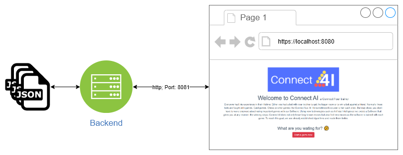
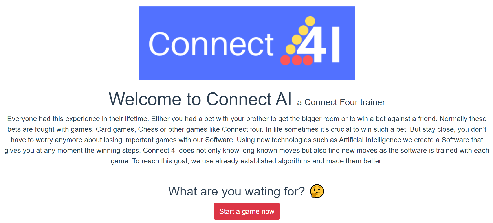
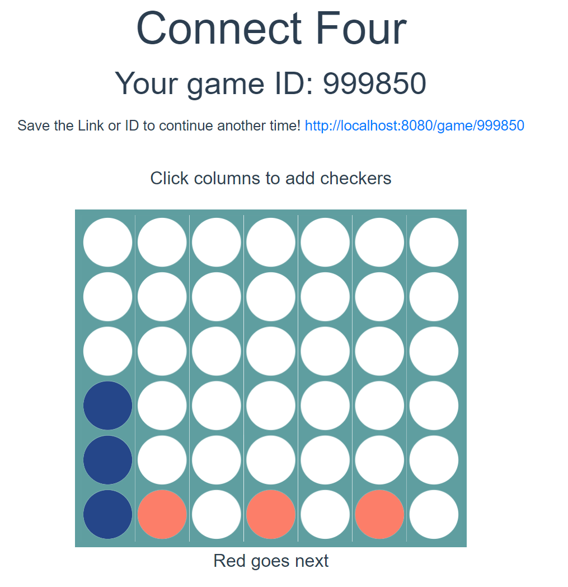

# HYU-software-engineering-AI
**Project done during a semester at Hanyang University.**

**Important links**
- [REST API DOC](./REST-API.md)

## Contributors
- **Fabio Motta** (AI)
- **Marie Pors** (AI)
- **Bouillette Nicolas** (Software Engineering & AI)
- **Ren Luca** (Software Engineering & AI)
- **Robidou Lucas** (Software Engineering & AI)
- **Schirinzi Francesco** (Software Engineering & AI)

## Abstract
During the second semester at Hanyang
University, we were asked to make a project that involved both
Software Engineering and Artificial Intelligence. Our team
decided to make a game, and we chose to implement "4 wins"
(also known as "Connect Four"). This game is a turn-based
game, which involves two players trying to connect four of their
checkers in a row while preventing their opponent (the other
player) from doing the same. This game will be playable through
a web interface, and the outcomes will be saved on the server.
Thus, we will be able to feed the AI with every game played
before. Players will then be able to face the AI in the game.

## Introduction
Everyone had this experience in their lifetime. Either you
had a bet with your brother to get the bigger room or to win a
bet against a friend. Normally these bets are fought with
games. Card games, Chess or other games like Connect Four.
In life sometimes it’s crucial to win such a bet. But stay close,
you don’t have to worry anymore about losing important
games with our Software. Using new technologies such as
Artificial Intelligence we create an app that gives you at any
moment the winning steps. Connect 4I does not only know
long-known moves but also finds new moves as the software
is trained with each game. To reach this goal, we use already
established algorithms and make them better. We will not
only provide you with a tool to win a bet but also make it to
you possible to reach your desires and dreams.

## Status
See the documentation to see the requirements of this project.
### Working
- Start a game
- Load old game
- Play against the AI

### Next steps
- Improve AI
- Improve documentation
  - Add a system sequence diagram

### Possible features
- Undo move
- Set difficulty

## Overview of the communication


## Frontend

**For the frontend, we followed the linked tutorial to have a simple working Connect Four game. It was then extended to meet the requirements of the university project.**

- [Connect-Four tutorial](https://rossta.net/blog/series/connect-four.html) 

###  Overview of the design


### Instlallation & Usage
First change the directory: `cd src_frontend`
#### Project setup
```
yarn install
```

##### Configure the environment variables
Update the `VUE_APP_BACKEND_URL` variable to the backend endpoint
```
nano .env
```

##### Compiles and hot-reloads for development
```
yarn run serve
```
  
## Backend
## Instlallation & Usage
#### Project setup
```
sudo apt-get install python3-pip git
python3 -m pip install bottle
git clone https://github.com/Ribodou/HYU-SE-Backend
```

##### Launch the server
```
cd src_backend
python3 src/main.py
```

**Please check the configuration of your firewall if you want to be able to launch the front part on another computer.**
  

## Images
### Home


### Connect Four Board



